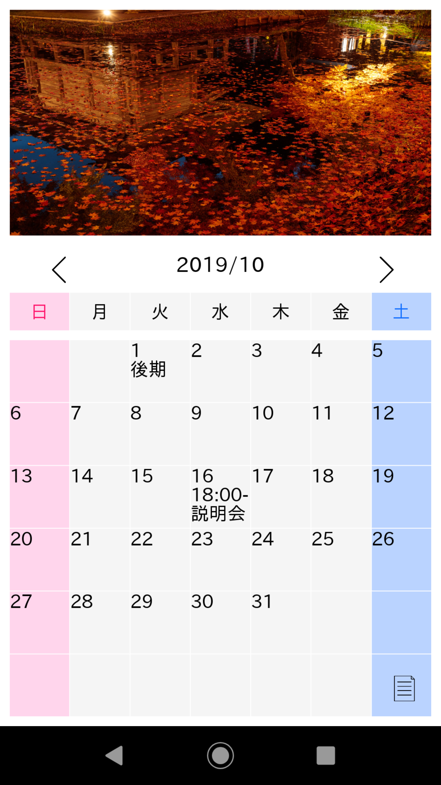
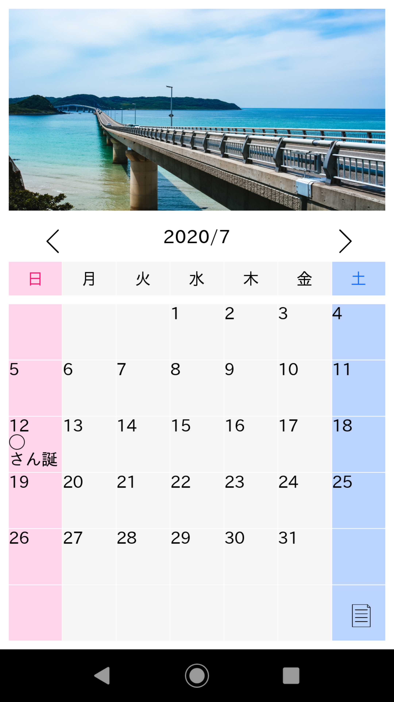
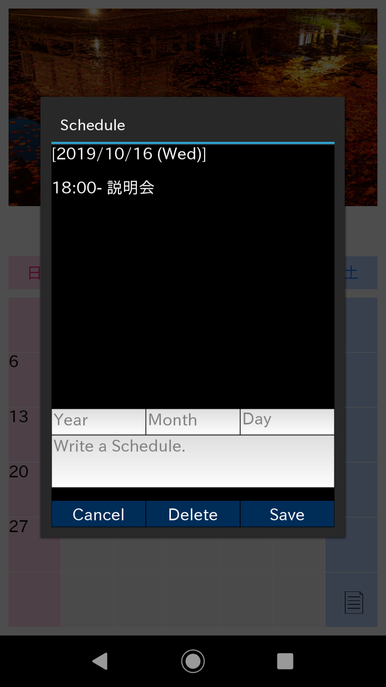
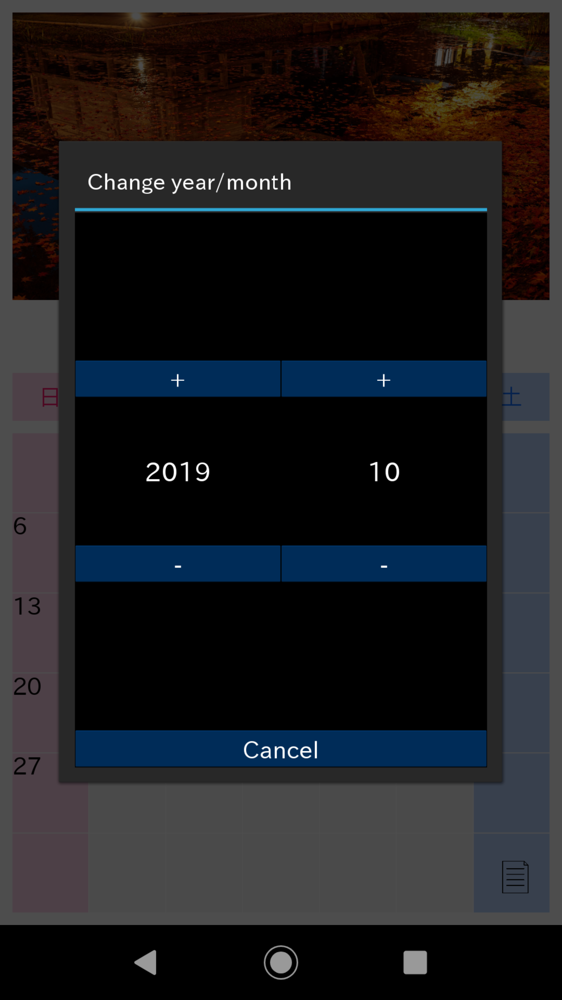
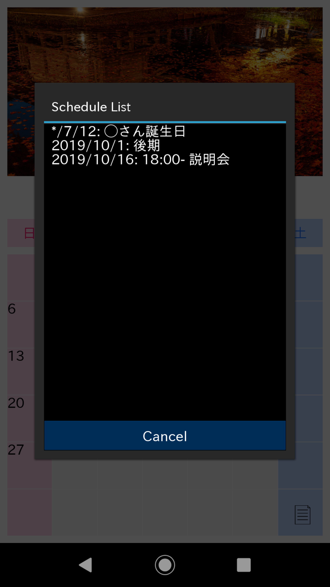

# kivy_calendar

## 概要
 スクリーンショット： 
 
  

月ごとに写真が変わるカレンダーアプリです。各日に予定を書き込むこともできます。mac及びAndroidで動作確認しています。 
※サンプルのpicturesフォルダ内の画像についてはいずれもPAKUTASOさん（https://www.pakutaso.com ）のフリー画像を使用しています。
 

・実行すると始めに今日の日付を取得しその月のカレンダーを表示します。カレンダーは>ボタンを押すと次月、<ボタンを押すと前月に切り替えることができます。また年/月部分を押すと切り替え画面が出るのでそこでも変更することができます。
~~~
# 起動した日を初期値としてセット
self.year = datetime.date.today().year
self.month = datetime.date.today().month
self.day = datetime.date.today().day
~~~
 

・カレンダー部分には7×6=42個のボタンを配置しており、自作のchange_day()メソッドで各ボタンに日付を表示させています。
~~~
# 年/月を指定するとその年/月の内容にボタンの日付を更新する
def change_day(self, year, month):
    """最初に各ラベルを初期化"""
    self.clr_btn_txt()

    cl = Calendar(firstweekday=6) # タプル(日付,曜日)が週毎に返される
    month_cl = cl.monthdays2calendar(year, month)
    i = 1 # "1"週目で初期化
    j = 0
    for week in month_cl:
        # weekは[1週目],[2週目],...
        for day in week:
            # dayは週毎の各日の(日付,曜日)
            if day[1] + 1 == 7: j = 0
            else: j = day[1] + 1

            if not day[0] == 0: self.set_btn_txt(i, j, str(day[0]))
        i += 1
~~~

流れとしてはclr_btn_txt()で一度表示を消した後、monthdays2calendar()でカレンダーを[[(日付,曜日),(日付,曜日),…],[],…]のような形式で取得しその値を基に対応するボタン(ボタンにはidが割り当てられている。)を指定して日付を表示させています。なお本プログラムでは(日)を0、(月)を1、…のように各曜日に数字を割り当て、縦方向には1週目、2週目、…のように指定しています。
 

・各日付のボタンを押すとその日の予定がポップアップウィンドウで表示されます。ウィンドウの下部には入力フォーム及びDeleteボタンとSaveボタンが配置されており、ここで予定の削除と追加を行うことができます。
~~~
# カレンダーの各日付のボタンを押した時の処理
def select(self, row, col):
    if not self.get_btn_txt(row, col) == "":
        schedule = self.get_btn_txt(row, col)
        schedule_split = schedule.split('\n')
        text = ""
        if len(schedule_split) == 1:
            text = text + '[' + str(self.year) + '/' + str(self.month)  + '/' + str(schedule_split[0]) + str(self.get_week_day(col)) + ']' + '\n' + '\nNone'
        else:
            for i in range(len(schedule_split)):
                if i == 0: text = text + '['  + str(self.year) + '/' + str(self.month)  + '/' + str(schedule_split[0]) + str(self.get_week_day(col)) + ']\n'
                else: text = text + '\n' + schedule_split[i]
        PopupList.set_label(text)

        content = PopupList(cancel=self.cancel, delete=self.delete, save=self.save)
        self.popup = Popup(title="Schedule", content=content, size_hint=(.8, .7))
        self.popup.open()
~~~

Year/Month/Dayを指定して予定を書き込みSaveを押すことでその日の予定が保存されます。誕生日のように毎年表示させたい予定についてはYear部分を空欄にしてMonth/Dayだけ指定してください(csvファイル内ではYear部分が*で保存されます)。なお年月日のいずれかが数字じゃない、又は月日のいずれかが入力されていない場合には保存できません。 

予定の削除方法については、月日を入力し消したい予定を入力フォームにそっくりそのまま書いた状態でDeleteボタンを押すことで消すことができます(例:2019/10/02の″買い物して帰る″という予定を消したい場合にはYearを除いた各入力フォームに10、2、買い物して帰ると入力した状態でDeleteを押すことでその予定が削除されます)。
 

・csvファイルに記録された予定はread_schedule()を用いて対応する日にちのボタン上に表示させています。また画面右下のアイコンを押すことで予定の一覧を日付順に表示させることもできます。
~~~
# schedule.csvから予定を取得してカレンダーに書き出す
def read_schedule(self):
    """csvファイルからデータを読み出す"""
    schedule_list = []
    f = open("schedule.csv","r")
    reader = csv.reader(f)
    schedule_list = [row for row in reader]
    f.close()

    """読み込んだデータを書き出す"""
    for schedule in schedule_list:
        try:
            if schedule[0] == '0' or schedule[0] == str(self.year):
                if schedule[1] == str(self.month):
                    date = datetime.datetime(self.year, int(schedule[1]), int(schedule[2]))
                    n_week, week_day = self.__get_week_number(date), (date.weekday() - 6) % 7
                    self.add_btn_txt(n_week, week_day, '\n' + schedule[3])
        except:
            pass
~~~
 

・画像はsetImage()を用いて月に対応する名前の画像を表示させています(例えばpicturesフォルダ内の1.jpgという名前の画像は1月に、8.jpgという名前の画像は8月に表示される)。なお年月という名前の画像(例:201908.jpg)を用意すれば対応する年月の時にのみその画像を表示させることもできます。
~~~
# 画像のセット
def setImage(self):
    """名前が年月または月の画像があれば読み込み、対応する年月で表示する"""
    self.background_through = 1

    pictures = glob.glob('pictures/*')
    target = "image/default.jpg"

    for i in range(len(pictures)):
        filename, ext = os.path.splitext(pictures[i])

        if filename == str('pictures/' + str(self.year) + str(self.month)):
            target = pictures[i]
            break

        elif filename == str('pictures/' + str(self.month)):
            target = pictures[i]
            break

    self.background = target
~~~
